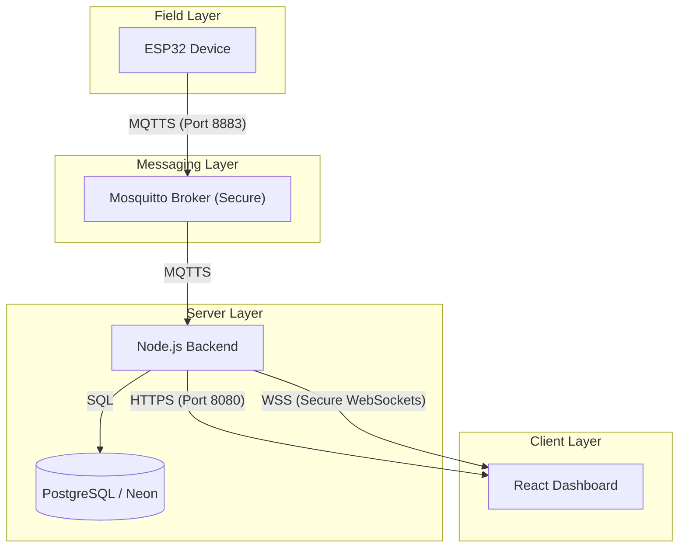

# System Architecture - IAIndustria4.0

This document describes the high-level architecture and communication flow of the **IAIndustria4.0** project, focusing on the secure end-to-end implementation (TLS/SSL).

## 🏗️ Overall Architecture

The system is composed of four main layers:
1.  **Field Layer (IoT)**: ESP32 devices collecting ADC data and controlling actuators (Relays/Dimmer).
2.  **Broker Layer**: Mosquitto MQTT Broker acting as the central communication hub.
3.  **Backend Layer**: Node.js (Express) server with AI capabilities (TensorFlow.js) and real-time data ingestion.
4.  **Presentation Layer**: React (Vite) Dashboard for monitoring, control, and AI-driven analysis.

## 🔒 Security Model (End-to-End TLS)

We have implemented a complete security layer using **TLS/SSL** certificates.



### Communication Protocols
| Link | Protocol | Security | Port |
| :--- | :--- | :--- | :--- |
| **IoT -> Broker** | MQTTS | TLS (CA Validation) | 8883 |
| **Backend -> Broker** | MQTTS | TLS (Client Certs) | 8883 |
| **Backend -> Frontend** | HTTPS | TLS (SSL) | 8080 |
| **Backend -> Frontend** | WSS | WebSocket Secure | 8080 |
| **Frontend Dev** | HTTPS | TLS (SSL) | 8086 |

## 📁 Project Structure

```text
IAIndustria4.0/
├── Documentacion/      # Project thesis and detailed documentation (LyX)
├── Esp32/
│   └── ApEsp32/        # PlatformIO Firmware (C++)
├── Plc/                # React Frontend (Vite)
│   ├── src/            # Components, Context, Views
│   └── vite.config.mjs # HTTPS & Port 8086 configuration
└── Servidor/           # Node.js Backend
    ├── certs/          # SSL/TLS Certificates
    ├── lib/            # Server Core & HTTPS setup
    └── mqtt/           # Secure MQTT Client logic
```

## 🛠️ Key Technologies
*   **Hardware**: ESP32, ADC Sensors, GPIO Actuators.
*   **Backend**: Node.js, Express, Socket.io, MQTT.js, TensorFlow.js.
*   **Frontend**: React, Vite, CoreUI Pro, Danfo.js.
*   **Database**: PostgreSQL (Neon.tech).
*   **Security**: OpenSSL (TLS v1.2/v1.3).
